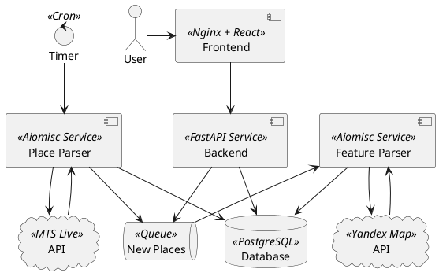
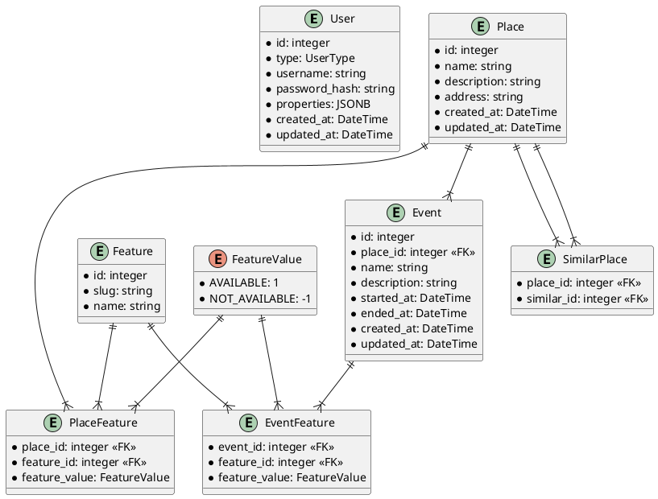

# True Tech Hack 2024

...

## Architecture

## Database Schema

## Stack

### Python libs

- [Aiomisc](https://aiomisc.readthedocs.io/en/latest/) for DI and service organization
- [FastAPI](https://aiomisc.readthedocs.io/en/latest/) with uvicorn for REST backend with Swagger (can be replaced with aiohttp)
- [SqlAlchemy](https://www.sqlalchemy.org/) with [Alembic](https://alembic.sqlalchemy.org) for database
- [Poetry](https://python-poetry.org/) for requirements management and project config

### JS stack

- ...

## Deployment

## Expluatation

After starting project via `docker-compose.yaml` you can open docs on:

- [Swagger](http://127.0.0.1/docs/swagger)
- [Redoc](http://127.0.0.1/docs/redoc)
- [OpenAPI JSON](http://127.0.0.1/docs/openapi.json)
